#  Inspector 窗口可编辑的变量

​      Inspector 显示的可编辑内容就是脚本的成员变量。注：以下内容中的`显示编辑` 是指在Inspector 窗口中编辑。

##  1 知识点一  私有和保护无法显示编辑

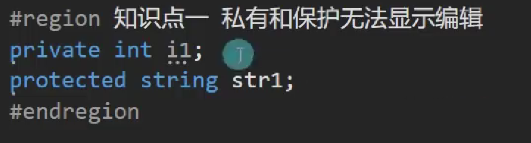

##  2 知识点二  让私有的和保护的也可以被显示

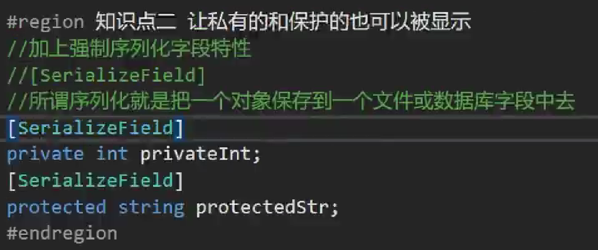

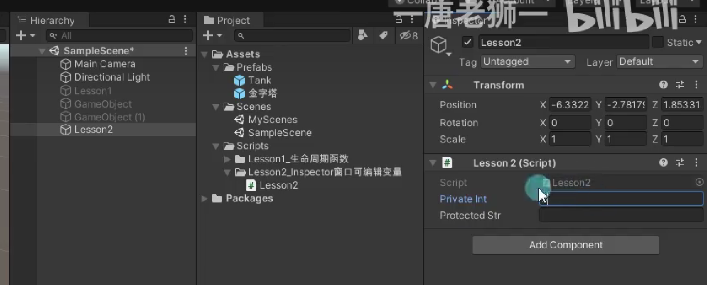

##  3 知识点三  公共的可以显示编辑

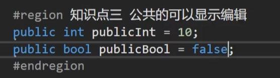

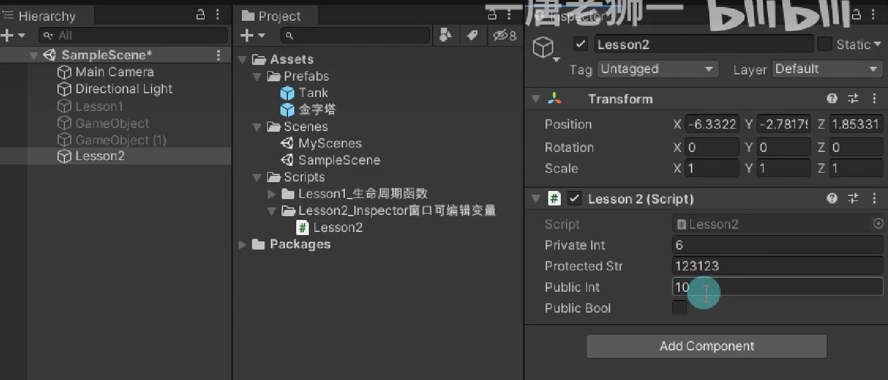

##  4 知识点四  公共的也可以不让其显示

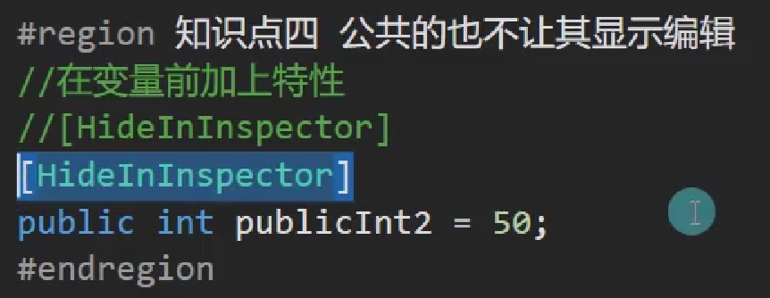

##  5 知识点五  大部分类型都能显示编辑

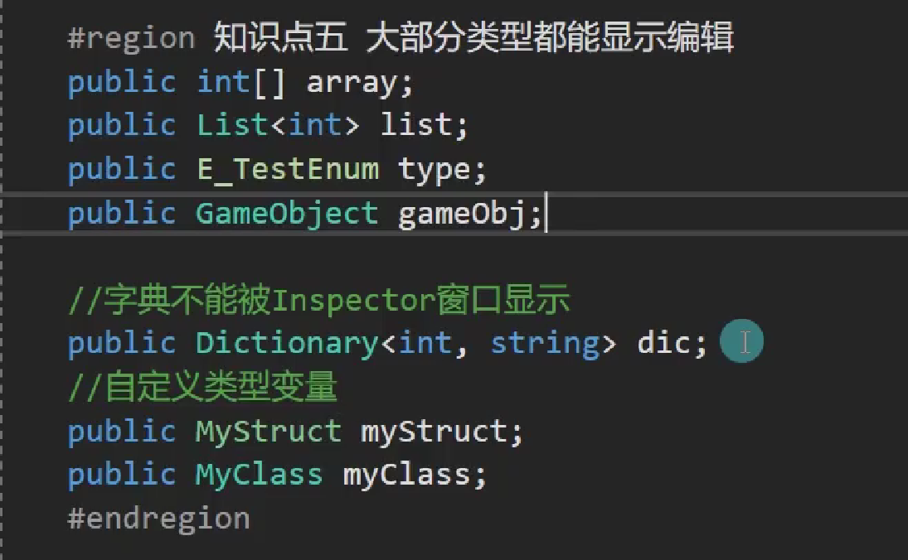

##  6 知识点六  让自定义类型可以被访问

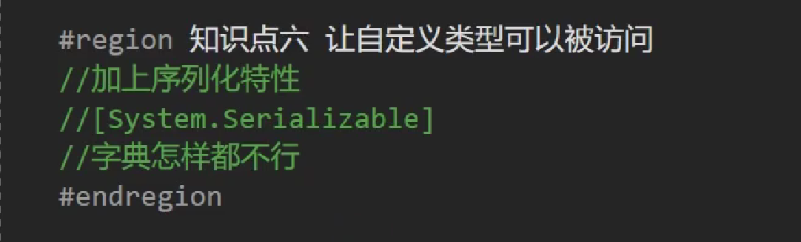

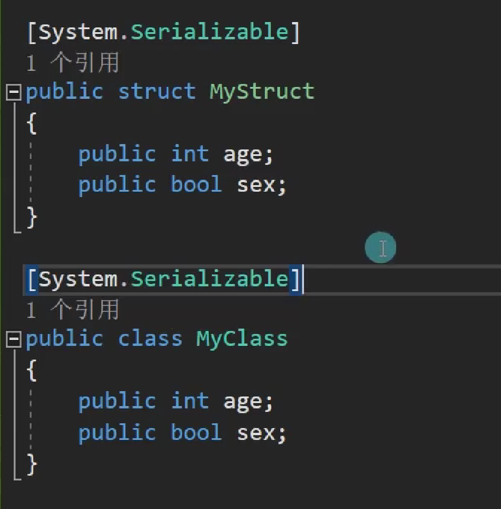

##  7 知识点七  一些辅助特性

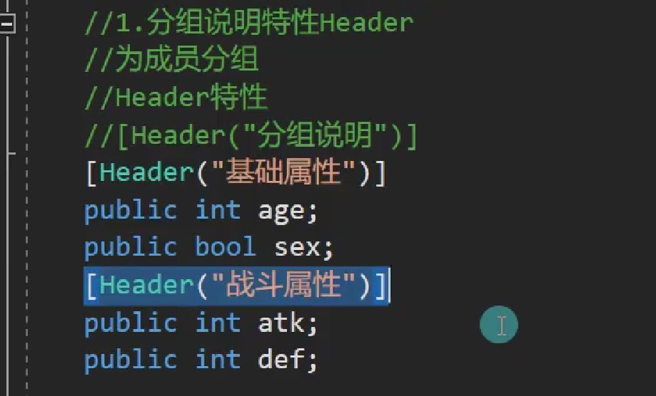

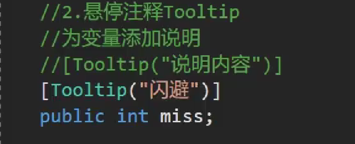

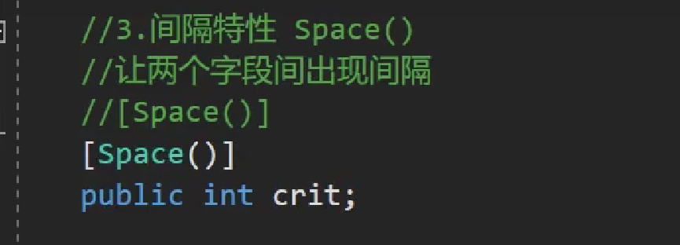

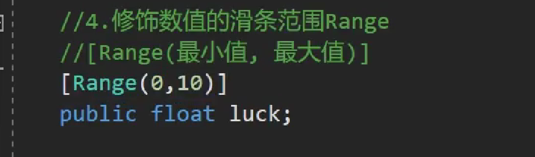

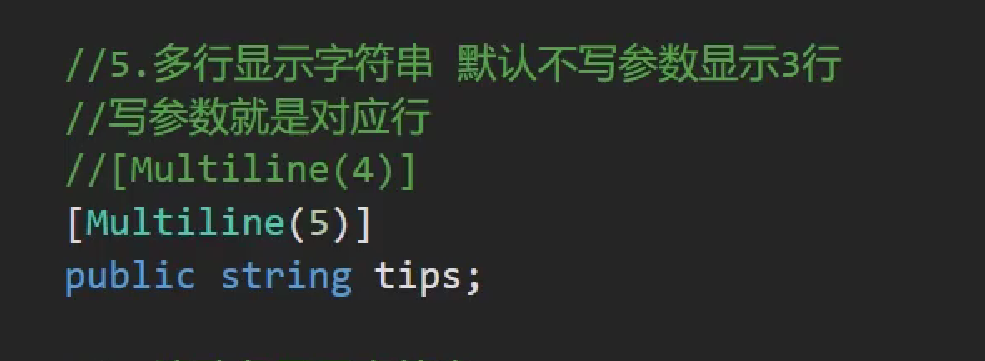

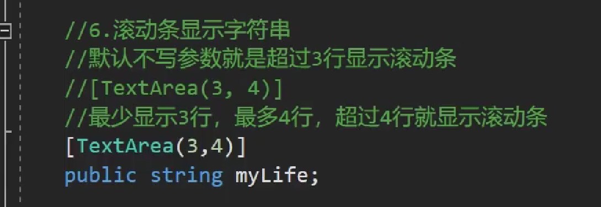

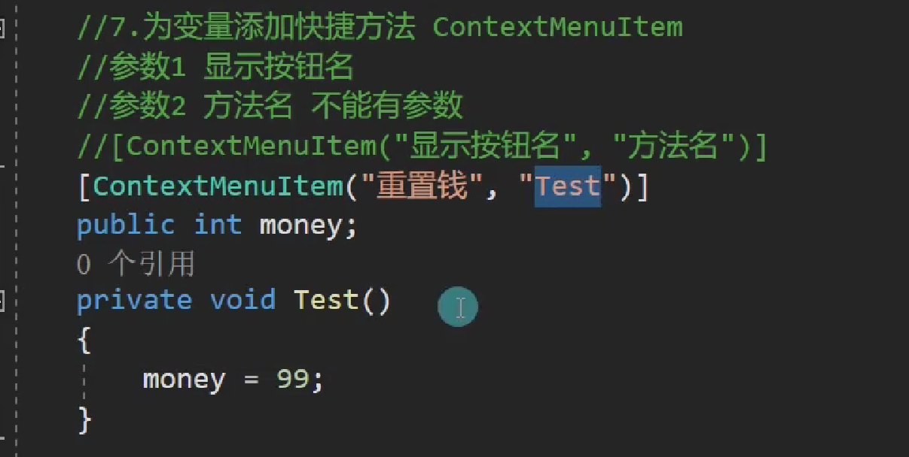

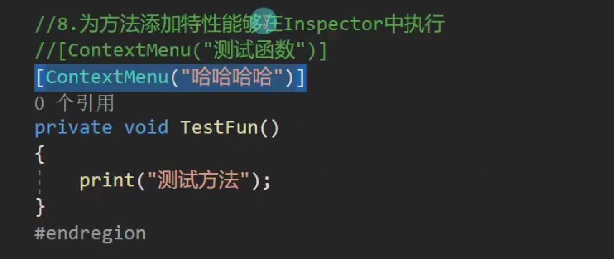

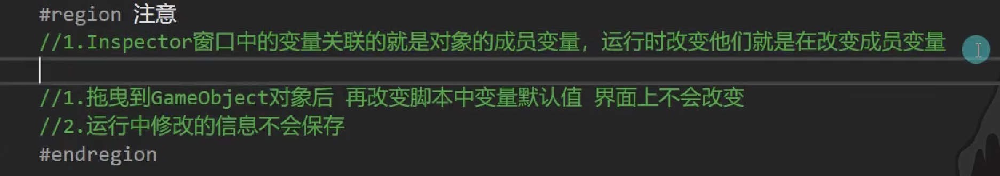