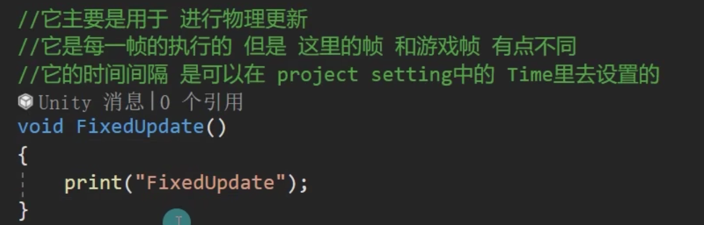

# 生命周期

##  1 帧的概念

## 2 生命周期

Unity的生命周期函数是用于控制游戏对象和组件的行为顺序的一组方法。以下是Unity中一些主要的生命周期函数及其作用：

1. **Awake()**：
    - 在对象被创建时调用。用于初始化不依赖其他对象的数据。
    - 调用顺序：在所有对象的Awake()方法被调用后，才会调用Start()方法。

2. **OnEnable()**：
    - 当对象启用时调用（包括初次创建或从非活动状态变为活动状态时）。
    - 适用于初始化或重置对象。

3. **Start()**：
    - 在对象第一次被启用时调用。适用于依赖其他对象初始化的数据。
    - 调用顺序：在所有对象的Awake()方法被调用后，才会调用Start()方法。

4. **FixedUpdate()**：
    - 以固定时间间隔调用，用于处理物理相关的更新。
    - 调用频率独立于帧率，通常为每秒50次（可以在项目设置中调整）。

5. **Update()**：
    - 每帧调用一次，用于处理常规的更新逻辑。
    - 调用频率与帧率一致。

6. **LateUpdate()**：
    - 在所有的Update()方法调用之后调用。适用于需要在所有Update()方法完成后处理的逻辑。
    - **常用于相机跟随等需要确保所有物体已更新完毕的情况。**

7. **OnDisable()**：
    - 当对象被禁用或销毁时调用。
    - 适用于清理资源或停止正在进行的行为。

8. **OnDestroy()**：
    - 在对象被销毁时调用。用于清理资源。
    - 与OnDisable()的区别在于，它专门用于对象的销毁而不是禁用。

9. **OnApplicationQuit()**：
    - 当应用程序退出时调用。适用于保存数据或清理资源。

10. **OnGUI()**：
    - 用于处理和绘制GUI元素，每帧调用多次。

###  2.1 void Awake（）函数

###  2.2 `void OnEnable（）`函数

###  2.3 void Start() 函数

###  2.4 `void FixedUpdate() `函数

**注：**可以修改物理帧更新（`FixedUpdate`）的时间,如下图所示

###  2.5 void Update() 函数

###  2.6 `void LateUpdate()` 函数

###  2.7 `void OnDisable()` 函数

###  2.8 `void OnDestroy()` 函数

